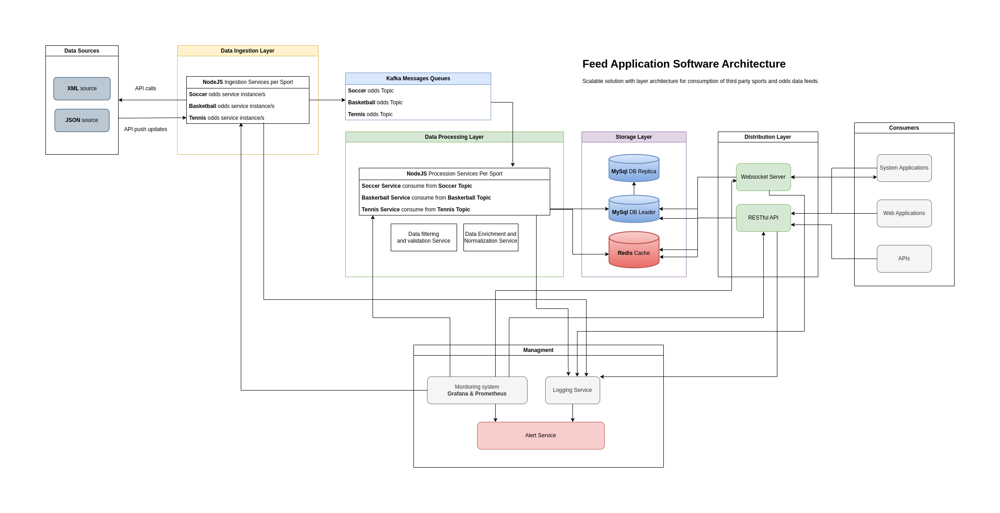

# Sports Betting Data Processing System



A distributed system for processing and distributing sports betting data in real-time. The system handles multiple sports (football, basketball, tennis, hockey) with separate processing pipelines for each sport.

## Architecture

The system consists of several microservices:

1. **Feed Ingestion Service**
   - Receives sports data feeds in JSON/XML format
   - Validates and transforms incoming data
   - Distributes data to sport-specific Kafka topics

2. **Data Processing Services** (One per sport)
   - Consume data from sport-specific Kafka topics
   - Process and validate events, participants, and odds
   - Store data in MySQL
   - Cache processed data in Redis

3. **Data Distribution Service**
   - Provides REST API for querying event data
   - WebSocket server for real-time updates

4. **Test Feed Generator**
   - Generates test data for development and testing
   - Simulates real-time sports data feeds

### Infrastructure Components

- **Kafka**: Message broker for event streaming
- **Redis**: Caching layer for fast data access
- **MySQL**: Persistent storage for events and odds
- **Docker**: Containerization for all services

## Architecture Benefits

1. **Scalability**
   - Independent scaling of sport-specific processors
   - Horizontal scaling of Kafka consumers
   - Redis caching for high-performance reads

2. **Reliability**
   - Message persistence in Kafka
   - Transaction support in MySQL
   - Automatic retry mechanisms
   - Health checks for all services

3. **Maintainability**
   - Clear separation of concerns
   - Independent deployment of services
   - Centralized logging
   - Easy monitoring and debugging

4. **Performance**
   - Parallel processing of different sports
   - In-memory caching with Redis
   - Efficient data distribution via WebSocket
   - Optimized database queries

5. **Flexibility**
   - Support for multiple data formats (JSON/XML)
   - Easy addition of new sports
   - Configurable processing pipelines
   - Extensible API endpoints

## Prerequisites

- Docker and Docker Compose

## Installation

1. Clone the repository:
```bash
git clone <repository-url>
cd sportsbets
```

2. Build and start the services:
```bash
docker-compose up --build
```

This will start all services:
- Feed Ingestion Service (port 4000)
- Data Processing Services (ports 4101-4104)
- Data Distribution Service (ports 4002-4003)
- Test Feed Generator (port 4004)
- Kafka (port 9092)
- Redis (port 6379)
- MySQL (port 3307)

## Monitoring and Management

### Service Health Checks

1. Feed Ingestion Service:
```bash
curl http://localhost:4000/health
```

2. Data Processing Services:
```bash
curl http://localhost:4101/health  # Football
curl http://localhost:4102/health  # Basketball
curl http://localhost:4103/health  # Tennis
curl http://localhost:4104/health  # Hockey
```

3. Data Distribution Service:
```bash
curl http://localhost:4002/health
```

### Viewing Logs

1. All services:
```bash
docker-compose logs -f
```

2. Specific service:
```bash
docker-compose logs -f data-processing-football
docker-compose logs -f feed-ingestion
```

3. Filter logs by level:
```bash
docker-compose logs -f | grep "error"
docker-compose logs -f | grep "warn"
```

### Kafka Topics

1. List all topics:
```bash
docker-compose exec kafka kafka-topics.sh --list --bootstrap-server localhost:9092
```

2. View messages in a topic:
```bash
docker-compose exec kafka kafka-console-consumer.sh --bootstrap-server localhost:9092 --topic sports-feed-football --from-beginning
```

3. Monitor topic statistics:
```bash
docker-compose exec kafka kafka-topics.sh --describe --bootstrap-server localhost:9092 --topic sports-feed-football
```

### Redis Monitoring

1. Connect to Redis CLI:
```bash
docker-compose exec redis redis-cli
```

2. View all keys:
```bash
KEYS *
```

3. Monitor Redis operations in real-time:
```bash
MONITOR
```

4. Check Redis info:
```bash
INFO
```

### MySQL Access

1. Connect to MySQL:
```bash
docker-compose exec mysql mysql -u sportsbet -p
```

2. View tables:
```sql
USE sportsbet;
SHOW TABLES;
```

## Future Development

### High Availability and Scalability

1. **MySQL Replication**
   - Set up MySQL master-replica architecture
   - Configure read replicas for scaling read operations
   - Implement automatic failover
   - Add connection pooling for replica reads
   - Monitor replication lag

2. **Monitoring and Observability**
   - Deploy Prometheus for metrics collection
   - Set up Grafana dashboards for:
     - Service health monitoring
     - Kafka consumer lag
     - Redis cache hit rates
     - MySQL performance metrics
     - API response times
   - Configure alerting rules
   - Add custom metrics for business KPIs

3. **Performance Optimization**
   - Implement database sharding
   - Add Redis cluster for high availability
   - Set up Kafka cluster with multiple brokers
   - Implement circuit breakers for external services